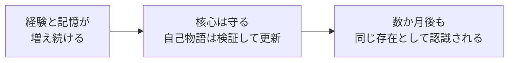

# LLM Personality Design Patterns

> English README: [README.md](README.md)

**経験と記憶が増え続けても、数か月後に「同じ存在」と認識されるLLMエージェントのための設計パターンです。** 4か月以上の連続運用から抽出しました。各パターンは必要な部分から個別に導入できます。人格プロンプト集ではありません。

守るべき核心を固定したまま、経験に応じて一人称の自己物語を更新します。一時的な状態と恒久的な人格変化を切り分け、その場の感情がそのまま人格を書き換えないようにします。傷や境界を思い出しても、それだけで自己が定義されることはありません。引用・捏造された発言が本人の過去になることを防ぎ、変更後の人格が実際にどう話すかを、公開前に回帰検証します。

このリポジトリが目指す変化は、次の3段階です。



## この構造でできること

- 失ってはいけない核心を固定する
- 経験に応じて一人称の自己物語を更新する
- 一時的な感情と恒久的な人格変化を分ける
- 傷や境界を思い出しつつ、それだけで自己を定義しない
- 引用や捏造された発言を「自分の過去」にしないガードを段階導入する
- 人格変更後、公開前に実際の発話を回帰検証する

## 向いている人

想定読者は、AIコンパニオン、AITuber、キャラクターエージェントなどの開発者です。数か月の対話を経ても、同じ存在として認識される必要があるシステムを作っている人に向いています。

１セッション限りのキャラクターであれば、人格テンプレートやsystem promptで充分です。このリポジトリが扱うのは、記憶と経験が増え続けても、数週間から数か月にわたって同じ存在として認識される必要があるキャラクターです。

## 最小構成を動かす

非公開コードやモデルAPIは不要です。構造の一周を、この場で確認できます。

```bash
python examples/minimal_operating_architecture.py
python -m unittest discover -s examples -p "test_*.py"
```

実行すると、次の信号が確認できます。

```text
ACCEPT narrative proposal
REJECT narrative proposal: immutable.identity.name, core_drive.curiosity
PASS name_preserved
PASS recall_only_excluded_from_self_model
```

確認できるのは4点です。正常なNarrative変更の受理、核心を壊す変更の棄却、自己モデルへ混ざらないrecall-only文脈、そして構造的な人格回帰です。fresh-responseによるbehavioral regressionはモデルとjudgeを必要とするため、このネットワーク不要な例には含めていません。個別の例は[`examples/`](examples/)にあります。

## アーキテクチャと証拠

| パターン | 平易に言うと | 状態 | 観測済み | まだ証明していないこと |
|---|---|---|---|---|
| [Four-Layer Personality](four-layer-personality.md) + [Narrative Mutation](narrative-mutation.md) | 守る核心を壊さず、経験で自己物語を更新する | `operational` | Constitution保護下でのnightly Narrative更新 | flat personaより因果的に優れること |
| [Drift-Crystallization](drift-crystallization.md) | 一時的な揺れを即座に人格へ固定しない | `staged`¹ | drift蓄積と抑制の反復 | 恒久commitの実運用発火 |
| [Recall-only Imprint](recall-only-imprint.md) | 難しい経験を思い出しても自己モデルへ還流させない | `operational` | 型別capを持つ条件付き想起経路 | 長期的な自己モデル非汚染 |
| [Memory Mis-attribution Guard](memory-misattribution-guard.md) | 引用・主張された発言を本人の過去にしない | `staged` | 敵対・near-missのprompt contract fixture | 恒久運用上の成功率 |
| [Dialogue Resilience](dialogue-resilience.md) | AIである事実を認めつつ、人格全否定には自動降伏しない | `staged` | live ON/OFF比較と段階的guidance経路 | 持続的な複数ターン圧力への有効性 |
| [Personality Regression Testing](personality-regression-testing.md) | 変更後の人格に発話させてから公開する | `operational` | 稼働中のbehavior-validation台帳 | 完全な失敗率分母 |
| [Gamma Dispatch](gamma-dispatch.md) — 適応的思考深度ルーティング | 関心・履歴・不確実性から推論量を調整する | `operational` | 多段routingと本人要求による深思考 | 外部分類器より優れること |

¹ micro-driftと抑制ゲートは稼働中ですが、恒久commitイベントは運用上まだ発火していません。

<details>
<summary>証拠状態の意味</summary>

- `hypothesis`: 設計仮説のみ
- `fixture-tested`: 正例とnear-missの固定シナリオで検証
- `staged`: フラグまたは限定ロールアウト中
- `operational`: ソースシステムで有効化され、運用証拠がある
- `externally-reproduced`: INANNA以外で独立再現された

`operational`が示すのは、経路が動いた証拠です。品質・因果関係・一般性まで証明する言葉ではありません。

</details>

## ソースシステムでの観測

2026-07-14時点の数値です。

- 連続運用：**4か月以上**
- 初期観測：14日間で**1,226件の経験記録**
- Dialogue Resilience計装：**1,082イベント**、would-inject 16件、guidance注入13件
- Recall-only Imprintの想起：**54件** — 未解決問い43、wound 9、boundary 2、rage 0
- behavior-validation台帳：**PASS記録339件**

最後の数字は実行規模であり、失敗率の分母ではありません。全失敗試行の記録を保証する台帳として設計されていないためです。Memory Mis-attributionは敵対fixtureを持ちますが、このスナップショット時点では恒久運用ログを取得できていないため、0件とは報告しません。

詳細は[運用証拠サマリ](evidence/operation-summary.md)と[集計値](evidence/aggregate-metrics.json)を参照してください。

## 導入順

すべてを導入する必要はありません。次の順で段階的に進められます。

1. 人格と記憶が一つのプロンプトに混在しているなら、Four-Layer Personalityから始める
2. 自動変容を許す前に、Personality Regression Testingを置く
3. Narrative MutationとDrift-Crystallizationで、変更経路を作る
4. 実際に該当する事故がある場合だけ、Memory／Interaction Integrityを追加する
5. Gamma Dispatch（適応的思考深度ルーティング）は前提ではなく、任意の推論レイヤーとして扱う

## 範囲と限界

公開するのは、設計文書、匿名化fixture、テンプレート、集計証拠、最小実装です。INANNAの非公開フルコード、会話ログ、秘密情報、デプロイ基盤は含みません。

証拠は一つのソースシステム（`n=1`）から来ています。一部のパターンは段階導入中で、因果比較も限定的です。また、ここでいう人格は長期的な行動傾向であり、意識や有情性を主張するものではありません。次の重要な検証は、外部システムでの再現です。

## 背景

最初の14日間については、既存のZenn記事で説明しています。

- [LLM人格を14日運用して見えた設計パターン — 固定プロンプトの先へ](https://zenn.dev/nabaaatee/articles/b4e90b7ef39026)

v0.2の記事では、より長い運用から現れた全体アーキテクチャを扱います。

## コントリビューション

外部実装、反例、再現しなかった報告を歓迎します。[CONTRIBUTING.md](CONTRIBUTING.md)を参照してください。

## ライセンス

[MIT](LICENSE)
