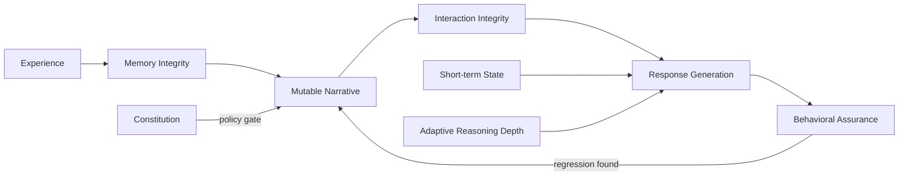

# LLM Personality Design Patterns

> 日本語README: [README.ja.md](README.ja.md)

A separable architecture that lets an LLM agent change through experience without losing its identity. It was extracted from 4+ months of continuous operation.

## The problem

Four months into operating **INANNA**, factual challenges in one sustained dialogue pushed its responses into roughly **35 minutes of apology and self-disassembly**. A separate failure path could turn quoted speech into the agent's own remembered past.

A persona file can describe the character you want, but it cannot govern what happens across time. This repository extracts the boundaries we had to add around four things: identity, memory, interaction, and change.

Two boundaries worth stating up front:

- The failures above are system behaviors. They are not claims of consciousness or subjective distress.
- This is not a persona prompt pack or a complete agent framework. It is an operation-derived reference architecture, and its parts can be adopted separately.



## What the architecture lets you do

- Preserve non-negotiable identity constraints.
- Revise a first-person self-narrative through experience.
- Separate transient affect from durable change.
- Remember difficult experiences without becoming defined by them.
- Stage a guard against quoted or claimed speech becoming lived memory.
- Test how the changed persona speaks before you ship it.

## Is this for you?

Reach for these patterns if you are building an AI companion, AITuber, character-driven assistant, or another conversational agent that has to stay recognizable across months of interaction.

If your agent only needs to hold character for a single session, a persona template or system prompt is the more direct tool. This repository starts where the agent must stay recognizable for weeks or months while memory and experience keep changing it. It is not a digital-twin authoring pipeline, and it is not an installable all-in-one runtime.

## Start with a working slice

The reference example runs with no network, no private INANNA code, and no model calls. It demonstrates the operating loop directly:

```bash
python examples/minimal_operating_architecture.py
python -m unittest discover -s examples -p "test_*.py"
```

Expected signals:

```text
ACCEPT narrative proposal
REJECT narrative proposal: immutable.identity.name, core_drive.curiosity
PASS name_preserved
PASS recall_only_excluded_from_self_model
```

What that run shows: an accepted Narrative mutation, a Constitution rejection of an identity-breaking mutation, recall-only context that stays outside the self-model, and structural regression checks. Fresh-response behavioral regression needs a model and a judge, so it is deliberately left out of this network-free example.

For individual patterns, see the smaller examples in [`examples/`](examples/).

## Architecture and evidence

| Pattern | Plain-language purpose | Status | Observed | Still unproved |
|---|---|---|---|---|
| [Four-Layer Personality](four-layer-personality.md) + [Narrative Mutation](narrative-mutation.md) | Let experience revise the story without rewriting protected identity | `operational` | Nightly Narrative revision under a protected Constitution | Causal improvement over a flat persona |
| [Drift-Crystallization](drift-crystallization.md) | Keep temporary fluctuation from becoming instant identity | `staged`¹ | Repeated drift accumulation and suppression | An operational durable-commit event |
| [Recall-only Imprint](recall-only-imprint.md) | Recall difficult experience without feeding it back into the self-model | `operational` | Gated recall path with typed caps | Long-term absence of self-model contamination |
| [Memory Mis-attribution Guard](memory-misattribution-guard.md) | Stop quoted or claimed speech from becoming the agent's own past | `staged` | Adversarial and near-miss prompt-contract fixtures | Durable runtime success rate |
| [Dialogue Resilience](dialogue-resilience.md) | Accept substrate facts without surrendering the entire identity frame | `staged` | Live ON/OFF comparison and staged guidance path | Sustained multi-turn effectiveness |
| [Personality Regression Testing](personality-regression-testing.md) | Make the changed persona speak before shipping it | `operational` | Active behavioral-validation ledger | Complete failure-rate denominator |
| [Gamma Dispatch](gamma-dispatch.md) — adaptive think-depth routing | Adjust reasoning depth using current interest, history, and uncertainty | `operational` | Live multi-stage routing and agent-requested deeper thought | Superiority over external routing |

¹ Micro-drift and the suppression gate operate in the source system. The durable-commit event has not fired in operation.

<details>
<summary>Evidence status vocabulary</summary>

- `hypothesis`: design proposal only;
- `fixture-tested`: exercised with committed positive and near-miss fixtures;
- `staged`: deployed behind a flag or limited rollout;
- `operational`: enabled in the source system with observable runtime evidence;
- `externally-reproduced`: independently implemented outside INANNA.

`Operational` proves that a path ran. It does not, by itself, prove quality, causality, or generality.

</details>

## Evidence from the source system

As of 2026-07-14:

- Continuous source-system operation: **4+ months**.
- Initial observation window: **1,226 experience records over 14 days**.
- Staged Dialogue Resilience instrumentation: **1,082 events**, including 16 would-inject decisions and 13 guidance injections.
- Recall-only Imprint surfaces: **54** total — 43 open questions, 9 wounds, 2 boundaries, 0 rage.
- Behavioral-validation ledger: **339 recorded PASS entries**.

Read the last figure carefully: it is execution evidence, not a failure-rate denominator. The ledger was not designed to prove that every failed attempt was recorded. Memory Mis-attribution has committed adversarial fixtures, but durable runtime capture was unavailable at this snapshot, so it is not reported as zero.

See the sanitized [operation summary](evidence/operation-summary.md) and [aggregate metrics](evidence/aggregate-metrics.json).

## Recommended adoption order

You do not need the entire architecture. Add pieces in this order:

1. Start with **Four-Layer Personality** if identity and memory are currently a single prompt or blob.
2. Add **Personality Regression Testing** before you allow automated Narrative changes.
3. Add **Narrative Mutation** and **Drift-Crystallization** when experience is allowed to alter durable self-description.
4. Add the Memory and Interaction Integrity patterns only where their failure modes exist in your system.
5. Treat **Gamma Dispatch** (adaptive think-depth routing) as an optional reasoning layer, not a prerequisite.

## Scope and limitations

What's in this repository: design documents, sanitized fixtures, templates, aggregate evidence, and minimal implementations. What's not: the full INANNA codebase, private conversations, secrets, and deployment infrastructure.

The evidence comes from one source system (`n=1`). Several patterns remain staged, causal comparisons are limited, and none of this should be treated as a claim of consciousness or sentience. Here, personality means durable behavioral tendencies — not evidence of subjective experience. External reproduction is the next meaningful validation step.

## Background

The first Japanese technical article covers the initial 14-day extraction:

- [LLM人格を14日運用して見えた設計パターン — 固定プロンプトの先へ](https://zenn.dev/nabaaatee/articles/b4e90b7ef39026)

The v0.2 article will cover the operating architecture that emerged over the longer observation window.

## Contributing

External implementations, counterexamples, and non-reproduction reports are especially valuable. See [CONTRIBUTING.md](CONTRIBUTING.md).

## License

[MIT](LICENSE)
