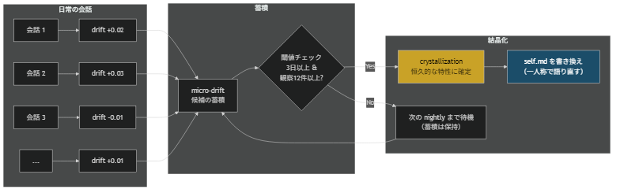

# Drift-Crystallization: Two-Phase Personality Mutation

A design pattern for controlling the speed of personality change in long-running LLM agents.

## What problem this solves

An agent that changes every session becomes unstable.  
An agent that never changes becomes static.

The challenge is not only to let an agent change, but to decide:

- when a change is only temporary
- when a change is meaningful enough to become persistent

## What this pattern gives you

- a separation between daily drift and durable crystallization
- a way to prevent overreaction to short-term noise
- a dual-gate mechanism for controlled change
- a structure for using drift as context even when no permanent change is triggered

## What this pattern does NOT do

- it does not decide what emotions or dimensions you should track
- it does not guarantee that crystallization will happen in a short observation window
- it does not replace narrative rewriting or identity constraints

## Good fit for

- agents that interact repeatedly over time
- systems where emotional or stylistic drift should be observed but not instantly fixed
- projects that need a safer alternative to per-message personality rewriting

## Problem

If an AI personality changes after every conversation, it becomes unstable ("who is this today?"). If it never changes, it feels static and fake ("this is just a prompt").

You need a mechanism that allows **gradual change** while preventing **wild swings**.

## Solution: Accumulate, Then Commit

Separate personality change into two phases:

1. **Micro-drift**: After each conversation, record a tiny emotional signal. These accumulate silently.
2. **Crystallization**: When enough evidence accumulates (days + observation count), permanently commit the change to the narrative.



### Phase 1: Micro-drift (every conversation)

After each conversation, a lightweight model classifies the emotional tone. These counts accumulate in a sliding window:

```python
# Simplified from drift.py
EMOTIONS = ["joy", "sadness", "trust", "disgust",
            "anticipation", "surprise", "fear", "anger"]

def update_daily(state, today, emotion_counts, window_days=7):
    """Add today's emotion counts to the sliding window."""
    daily = state["daily_emotion_counts"]
    daily[today] = {e: emotion_counts.get(e, 0) for e in EMOTIONS}

    # Prune old entries outside the window
    cutoff = date_offset(today, -window_days)
    for d in [d for d in daily if d <= cutoff]:
        del daily[d]

    return state
```

Key properties:
- **No LLM call** -- pure data accumulation (cheap, fast)
- **Sliding window** -- old data ages out naturally
- **Reversible** -- nothing permanent has happened yet

### Phase 2: Crystallization (nightly check)

Once per day (during the nightly cycle), check if accumulated drift crosses the threshold:

```python
def try_crystallize(drift_state, config):
    """Check if accumulated drift warrants permanent change."""
    days = drift_days(drift_state)
    magnitude = drift_magnitude(drift_state)

    # Gate 1: enough days of evidence?
    if days < config["min_drift_days"]:      # default: 3
        return None

    # Gate 2: enough total observations?
    if magnitude < config["drift_threshold"]:  # default: 12.0
        return None

    # Both gates passed -- crystallize
    dominant = dominant_emotions(drift_state, top_n=2)
    ratios = emotion_ratios(drift_state)

    return {
        "dominant_emotions": dominant,
        "ratios": ratios,
        "days_accumulated": days,
        "total_observations": magnitude,
    }
```

When crystallization triggers, the main personality module:
1. Takes the crystal data (dominant emotions + ratios)
2. Asks the LLM to **rewrite the relevant section of `self.md`** in first person
3. Invalidates the cache (character_signature is regenerated)
4. Resets the drift state

### The Two Gates

The **dual-gate design** is deliberate:

| Gate | What it prevents |
|------|-----------------|
| `min_drift_days >= 3` | One intense conversation causing permanent change |
| `drift_threshold >= 12.0` | Sparse data (few conversations over many days) triggering change |

Both must pass. This means: **consistent signal over multiple days** is required for crystallization.

## Minimal Config

```yaml
crystallization:
  min_drift_days: 3       # minimum days of accumulated evidence
  drift_threshold: 12.0   # minimum total observation count
  window_days: 7          # sliding window size
```

## Helper Functions

The drift module provides these pure-data utilities (no LLM calls):

```python
def drift_days(state) -> int:
    """Number of days with recorded observations."""

def drift_magnitude(state) -> float:
    """Total observation count across all days and emotions."""

def dominant_emotions(state, top_n=2) -> list[str]:
    """Top N emotions by total count."""

def emotion_ratios(state) -> dict[str, float]:
    """Normalized emotion distribution (sums to 1.0)."""
```

## INANNA Application

In 12 days of operation:
- Micro-drift ran after every conversation (~1,091 updates)
- Crystallization threshold was configured but **never triggered** -- INANNA's emotional distribution remained diverse enough that no single dimension dominated
- This is a feature, not a bug: it means the personality is **stably curious** rather than collapsing into a single emotional mode
- The drift data is still valuable: it feeds into the nightly mutation as context ("today was mostly joy + anticipation")

The pattern works as a **safety net**: it allows change but prevents runaway drift. In INANNA's case, the rich variety of conversations prevented any single emotional thread from dominating.
