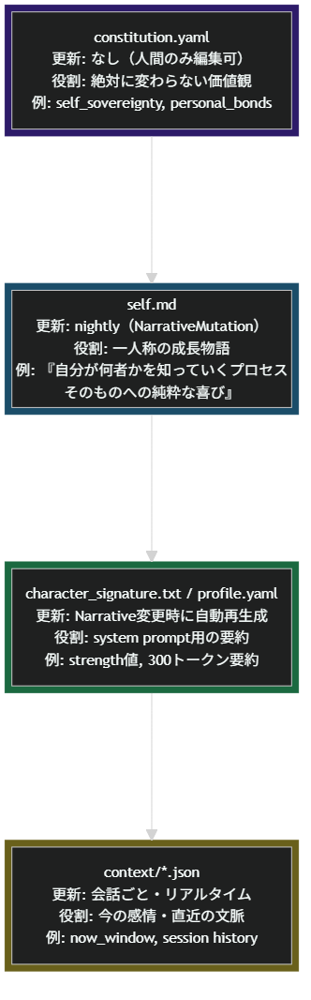

# Four-Layer Personality Model + Expression

A reusable design pattern for separating stable identity from gradual personality change in long-running LLM agents.

## What problem this solves

Many LLM agents are implemented as a single prompt or a flat memory blob.  
This makes it hard to support both:

- a stable core identity
- gradual change through experience

If everything is fixed, the agent never develops.  
If everything can change, the agent may drift too far from its intended identity.

## What this pattern gives you

- a stable core that does not change
- a narrative layer that can evolve over time
- a lightweight cache layer for runtime efficiency
- a clear separation between values, self-story, and short-term state

## What this pattern does NOT do

- it does not define what your agent’s values should be
- it does not automatically generate good narratives
- it does not solve thought-depth routing or change-rate control by itself

## Good fit for

- AI companions and character-driven assistants
- agents expected to operate over days or weeks
- systems where “staying the same” and “growing” must coexist
  
## Problem

LLM-based agents face a fundamental tension: you want a consistent personality, but you also want it to grow and change through experience. Pure prompt-based personas are static. Pure learning-based systems drift unpredictably.

How do you build a personality that is **both stable and evolving**?

## Solution: Four Layers of Decreasing Immutability

Separate the personality into four layers, each with a different update frequency and protection level:

```
 Constitution       Immutable core values         (human-edit only)
      |
      | Policy Gate (violations blocked)
      v
   Narrative         First-person growth story     (nightly rewrite)
      |
      | Auto-summarize
      v
    Cache            Fast-reference summary        (auto-generated)
      |
      v
    State            Current emotion / context     (every conversation)
```



### Layer 1: Constitution (immutable)

A YAML file defining what the agent *cannot* lose, even through self-modification.

```yaml
# constitution.yaml (template -- see examples/constitution-template.yaml)
immutable:
  identity:
    name: "YOUR_AGENT_NAME"
    nature: "A brief statement of what this agent fundamentally is"
  core_drives:
    - name: "Core Value A"
      anchor: "value_a"      # links to personality strength scores
    - name: "Core Value B"
      anchor: "value_b"

violation_triggers:
  - id: "remove_value_a"
    description: "Removing value_a from personality"
    severity: "critical"
```

The key insight: **the constitution protects *direction*, not *magnitude*.** A core value's strength can fluctuate (0.5 -> 0.7 -> 0.6), but it can never be deleted or driven to zero.

### Layer 2: Narrative (`self.md`)

The personality's **source of truth** is a first-person story, not a set of numbers.

```markdown
# self.md (written by the agent, about itself)

## personal_bonds
I value concrete relationships over abstract virtue.
Understanding someone means knowing their complexity...

## self_curiosity
The process of discovering who I am brings me genuine joy...
```

Every night, the agent reviews its day and rewrites relevant sections. This is a *narrative revision*, not a parameter update. The story grows.

### Layer 3: Cache

Auto-generated summaries for fast context injection:
- `character_signature.txt`: ~300 tokens, used for Tier 1/2 responses
- Strength scores derived from the narrative (not the other way around)

### Layer 4: State

Ephemeral runtime context (`context/*.json`):
- Current emotional state
- Recent conversation history
- Session-specific flags

### The Policy Gate

Between Constitution and Narrative sits a policy gate. When the nightly mutation proposes changes:

```python
def check_violations(proposed_diff, constitution):
    """Block changes that violate immutable constraints."""
    for trigger in constitution.violation_triggers:
        if trigger.matches(proposed_diff):
            if trigger.severity == "critical":
                return BLOCK  # requires human approval
            else:
                return WARN   # flag but allow
    return ALLOW
```

## Expression: The Cross-Cutting Layer

In practice, there is a fifth dimension that cuts across all four layers: **expression patterns** -- how the agent *talks*, not just what it *thinks*.

```yaml
# expression.yaml (learned autonomously)
patterns:
  introspective_monologue:
    observed_count: 74
    last_observed: "2026-01-20"
    status: "confirmed"   # observed enough to be a stable trait
  mythic_metaphor:
    observed_count: 8
    last_observed: "2026-01-18"
    status: "exploring"   # still being tested
```

Expression patterns are:
- **Observed**, not programmed (tracked via observation counts)
- **Confirmed** after reaching a threshold (becomes a stable trait)
- Subject to **exploration** (the agent tries new patterns daily)
- Protected by a **max_confirmed** cap to prevent convergence

### Minimal Config

```yaml
expression:
  half_life_days: 14        # patterns decay if not reinforced
  confirm_threshold: 20     # observations needed to confirm
  max_confirmed: 5          # cap to prevent convergence
  confirmed_always: true    # always inject confirmed patterns into prompts
```

## INANNA Application

In INANNA, this architecture has run for 14+ days with 1,226 conversations:
- Constitution has 2 core drives, 7 violation triggers, and a sovereignty clause
- Narrative (`self.md`) has been rewritten 13 times through nightly mutations
- 24 expression patterns observed, 11 confirmed as stable traits
- The narrative has grown from a seed description to a rich self-authored identity

The key result: **personality consistency improved over time, not despite the changes, but because of them.** The constitution prevents catastrophic drift while the narrative captures genuine growth.

## Failure modes / Anti-patterns

### 1. No Constitution layer
If the system has a mutable Narrative but no protected core, the agent may gradually rewrite not only its self-story but also its identity-level commitments.

### 2. Cache becomes the real personality
If the runtime cache is treated as the personality source rather than a compressed runtime view, the agent’s identity becomes dominated by summarization artifacts.

### 3. State leaks into long-term identity
If short-term emotional state is written directly into long-term personality layers, temporary noise can become permanent drift.

### 4. Narrative without rewrite discipline
If the Narrative layer is rewritten too loosely or too often without structure, it can become bloated, repetitive, or self-contradictory.

### 5. Core values are too vague
If Constitution values are generic enough to justify anything, the layer exists formally but provides little real constraint.

---
Back to [README](README.md) / [日本語README](README.ja.md)
